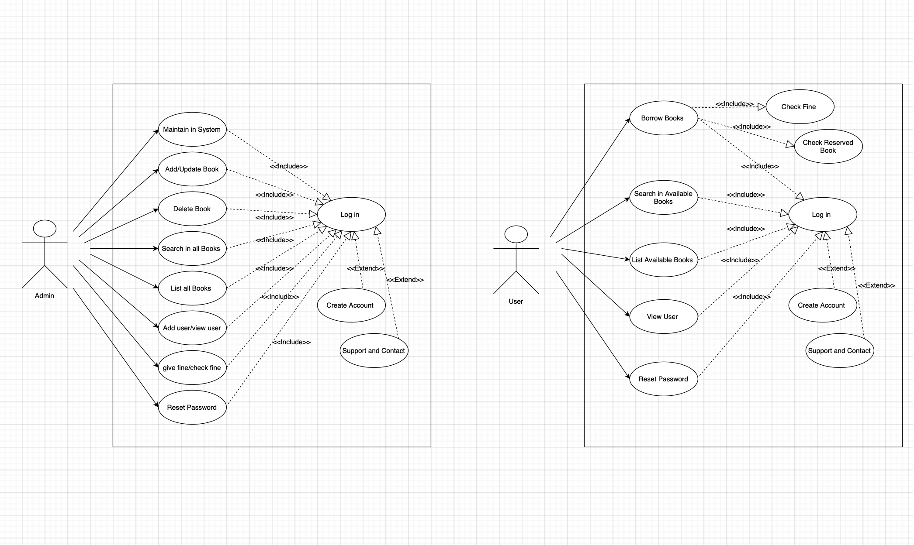
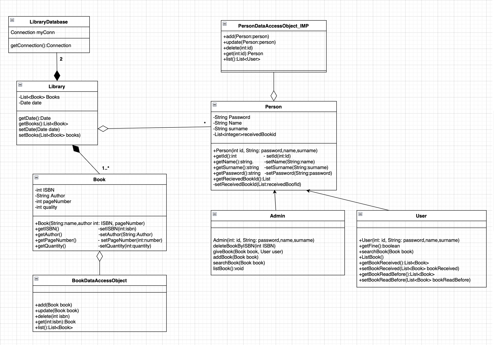
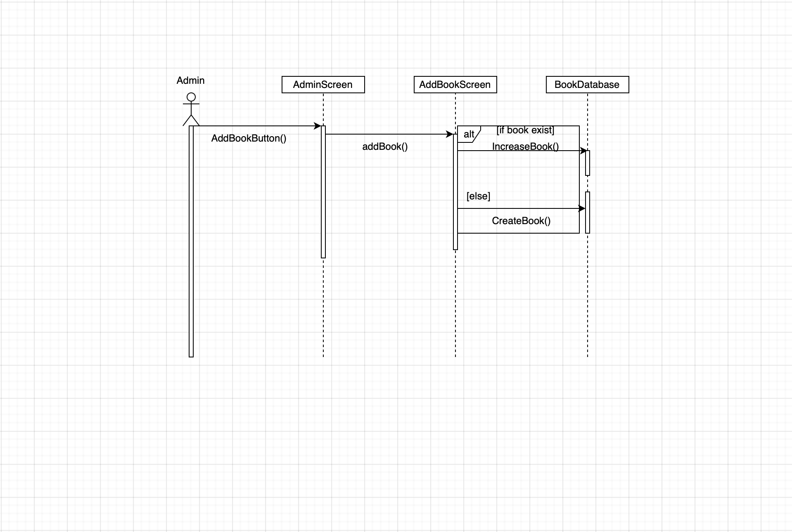

# OOD_finalProject

Abstract: 

Library Management system allows for the management of books, users, and borrowing activities in a library. The project includes a graphical user interface (GUI) using JavaFX that enables easy interaction with the system. The GUI allows users to search for books, borrow and return books, and manage user accounts.
This system has two actors: Admin and User. Admins are responsible for managing the books, users, and borrowing activities, while the users can only search for and borrow books. The system includes various features such as user authentication, book reservation, and overdue book tracking. The project utilizes object-oriented programming concepts and implements various design patterns, such as Singleton and Factory pattern, to ensure efficient and scalable code.
The outcome of this project is the development of a library system that aims to promote reading habits and knowledge among individuals who face access or financial barriers to reading. The library system is designed to provide readers with a wide range of book options and allow them to borrow books that they might not be able to access or afford otherwise.
The library system is expected to enhance the reading experience for individuals and promote a love for books and literature. The project aims to make a positive impact on the community by providing access to books and fostering a reading culture. The system also incorporates features such as user authentication, book reservation, and overdue book tracking to ensure efficient management of the library's resources.
Overall, the library system is expected to serve as a valuable resource for readers who are passionate about books and knowledge. The project highlights the importance of promoting reading culture and provides a practical solution for individuals who face barriers to accessing books

Problem Statement:

The habit of reading books is one of the habits that is tried to be given to us from an early age. Both in the fairy tales our parents read to us when we were little children, and the 'reading-writing' 
actions we learned when we started school have been important elements that tried to make the book a part of our lives.Despite the fact that access to books is widely available 
nowadays, many individuals still wish to read but are unable to do so because of their financial situation or the conditions of their homes. In addition, a lot of people acquire library culture 
and adore the ambiance despite not having access or financial issues.
The purpose of our project is to design a library where we provide the readers with options for books they might enjoy and, we can improve their reading habits and knowledge. It is a library system that can help folks who enjoy reading by letting them borrow the books that are out of their grasp because of access issues or budget constraints.

System Design:

The use case diagram shows how people interacting with the system interact, in the most general way. In our ‘Library Management System’ project there are two actors interacting with the system Admin and User. The admin is the person responsible for the basic works of the library, who interacts more with library than the user. User, on the other hand, is the person responsible who can borrow books from the library, list the books that has bought in the past, search the books in the library and have the rights to list the books by logging into the library with name and password determined by the user as shown in the Figure 1.

1. Use Case Diagram

2. Class Diagram

3. User Sequence Diagram

4. Admin Sequence Diagram

Conclusion:

This project includes all the features that a library needs. The primary goal of this project was to provide the people with a user-friendly application using which the admins can easily manage the books and the users can easily find the books which interest them. To assist employees in documenting the time and effort they put into their different work areas. To make the most of resources by increasing their productivity through automation. The system creates a variety of data that can be utilized for a variety of reasons. The project is fast and stable. We kept all user and book data in the database. User information is also securely stored. In addition, because we do not aim for any income, and we think that having this feature will further make this project better.  
There is a future scope of this facility that many more features such as reading books over the application, audio book feature, interface development, interface optimization according to the age of the user, pricing system, users can add books to the system etc. We are very hopeful for future features as this open-source project can be developed according to user needs.

